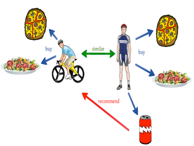
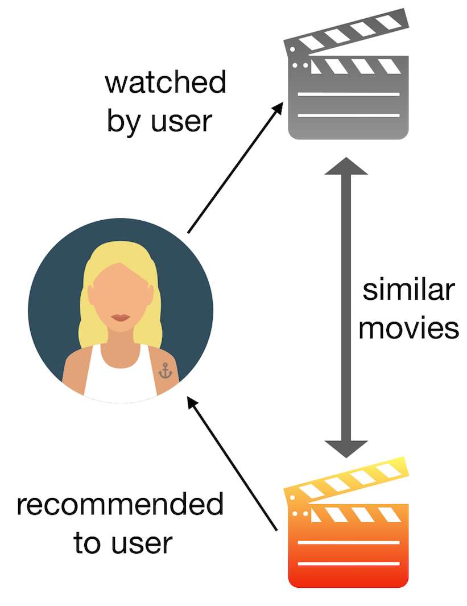

# Music Recommendation System based on Content and Collaborative Filtering 

_Keywords_ - Content filtering, Collaborative filtering, NLP, Singular Value Decomposition (SVD), Tfidf Vectorization, Cosine similarity, Cross-Validation, Precision-at-k, Recall-at-k, Dask, sklearn, Python, Pandas, Matplotlib  

## Context 

Music recommendation systems are algorithms designed to suggest music to users based on their past and current preferences, listening history, and behavior of other similar users on the same platform.  
This needs sophistication in providing personalized experience and enhancing engagement on the platform, leading to better customer retention and satisfaction.  

Ideal system should be able to handle - 

1. _Cold Start Problem_ - new items or users with limited interaction history
2. _Filter Bubble_ - reinforcing existing user preferences, lacking diversity 
3. _Dynamic Preference_ - adapting quickly to user's evolving taste over time
4. _Popularity Bias_ - popular items get more popular in positive feedback loop  

In this notebook, we will test two approaches -  

1. **Collaborative Filtering** - recommending items based on other similar users behavior.
   
   
3. **Content Filtering** - recommending items based on similarity of tracks to the user's listening history.

  
## Business Questions 

Sophisticated music recommendation systems are required to address various business, strategic and operational questions. Some of thema are -  

1. _User Retention and Engagement_ - How can we improve user retention and keep users engaged on our platform ?
2. _Content Dicsovery and Diversity_ - How can we help users discover new and diverse music content ?
3. _Monetization strategies_ - What strategies can we deploy in our recommendation system to optimize revenue generation ?
4. _Targeted marketing_ - How can we segment our user base for effective marketing ?
5. _Competitive edge_ - How can we maintain/improvise our recommendation system to have a competitive edge in the industry ?
6. _Adaptive user interface_ - How can we create adaptive user interfaces to enhance usability ?

## Data 

The dataset used in this analysis is an updated version of **Amazon review dataset** released in 2014 (https://cseweb.ucsd.edu/~jmcauley/datasets/amazon_v2/)  
Note that paper should be cited if this data is used in any published work - https://cseweb.ucsd.edu//~jmcauley/pdfs/emnlp19a.pdf  

We have used two types of data - 

1. **Meta Data** - contains details about the music tracks  
    * Only _trackID, title, brand, rank_ and _price_ data used 
    * Used for Content Filtering 
2. **Customer Data** - contains details about the users-tracks-ratings data with each user having rated **at least 5 music tracks**  
    * Only _trackID, userID and rating data used
    * Used for Collaborative Filtering 

## Metrics 

1. Precision-at-K - Of the top K recommendations made, what proportion is relevant or useful
2. Recall-at-K - How many of the relevant items are captured in the top K recommendations
